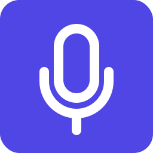

# EasyDictate

<p align="center">
  
</p>

<p align="center">
  <strong>Simple, Fast, Private Voice Dictation for Windows</strong>
</p>

<p align="center">
  <a href="https://easydictate.app">easydictate.app</a>
</p>

EasyDictate is a lightweight Windows application that lets you dictate text using your voice. Hold a hotkey, speak, and your words are instantly transcribed and ready to paste. All processing happens locally on your computer - your voice never leaves your device.

---

## Key Features

### Push-to-Talk Dictation
- Hold `Alt + Space` (customizable) to start recording
- Release to transcribe and copy to clipboard
- Works in any application - Word, email, browsers, code editors

### 100% Local & Private
- Uses OpenAI's Whisper model running entirely on your PC
- No cloud services, no API keys, no subscriptions
- Your voice data never leaves your computer

### Fast & Accurate
- Powered by whisper-base-en model optimized for English
- Transcription typically completes in 1-2 seconds
- Automatic punctuation and capitalization

### Minimal & Unobtrusive
- Lives in your system tray
- Small overlay shows recording/transcribing status
- No complex UI or configuration required

---

## Benefits

### For Privacy-Conscious Users
Traditional voice dictation services send your audio to cloud servers for processing. EasyDictate runs the entire speech recognition pipeline locally using the Whisper model. Your conversations, medical notes, legal documents, and personal thoughts stay on your machine.

### For Power Users & Developers
Voice input is up to 5x faster than typing for many people. EasyDictate integrates seamlessly into any workflow - dictate code comments, write documentation, compose emails, or take notes without switching contexts.

### For Users with RSI or Accessibility Needs
Reduce keyboard usage by speaking instead of typing. The push-to-talk interface is simple enough for anyone to use, and the local processing means it works offline.

### No Cost
Most voice dictation apps charge $10-15/month subscriptions. EasyDictate is free and open source - the underlying Whisper technology runs entirely on your own hardware with no fees ever.

---

## How It Works

### User Flow
1. **Start the app** - EasyDictate runs in the system tray
2. **Hold the hotkey** - Default is `Alt + Space`
3. **Speak** - A small overlay shows "Listening..."
4. **Release** - Audio is transcribed locally
5. **Paste** - Text is copied to clipboard, ready for `Ctrl+V`

### Technical Architecture

```
┌─────────────────────────────────────────┐
│           EasyDictate.exe               │
├─────────────────────────────────────────┤
│  System Tray Icon    │   Overlay Window │
├─────────────────────────────────────────┤
│  Global Hotkey Handler (Win32 API)      │
├─────────────────────────────────────────┤
│  Audio Capture (NAudio/WASAPI)          │
├─────────────────────────────────────────┤
│  Whisper.net (whisper.cpp bindings)     │
├─────────────────────────────────────────┤
│  Output: Clipboard or SendInput         │
└─────────────────────────────────────────┘
```

---

## Implementation Details

### Technology Stack

| Component | Technology | Purpose |
|-----------|------------|---------|
| Framework | .NET 8 / WPF | Windows-native UI and application |
| Speech Recognition | Whisper.net | C# bindings to whisper.cpp |
| Audio Capture | NAudio | WASAPI microphone recording |
| System Tray | Hardcodet.NotifyIcon.Wpf | Tray icon with context menu |
| Configuration | System.Text.Json | Settings persistence |

### Project Structure

```
src/EasyDictate/
├── App.xaml.cs                 # Application entry, service initialization
├── Services/
│   ├── AudioCaptureService.cs  # Microphone recording (16kHz mono)
│   ├── TranscriptionService.cs # Whisper.net integration
│   ├── HotkeyService.cs        # Global push-to-talk hotkey
│   ├── OutputService.cs        # Clipboard and keystroke output
│   ├── ModelManager.cs         # Model download and management
│   ├── SettingsService.cs      # JSON config persistence
│   └── DictationCoordinator.cs # Orchestrates the dictation flow
├── Views/
│   ├── OverlayWindow.xaml      # Listening/Transcribing indicator
│   ├── SettingsWindow.xaml     # Configuration UI
│   ├── FirstRunWindow.xaml     # Setup wizard
│   └── TrayIconViewModel.cs    # Tray icon logic
├── Models/
│   └── AppSettings.cs          # Settings model
└── Helpers/
    └── Win32.cs                # P/Invoke for hotkeys, SendInput
```

### Key Components

#### Audio Capture
- Uses WASAPI (Windows Audio Session API) for low-latency recording
- Captures at 16kHz mono PCM (Whisper's expected format)
- Automatically resamples from microphone's native format

#### Transcription
- Loads whisper-base-en GGML model (~140MB)
- Processes audio buffer directly in memory
- Filters common Whisper hallucinations (e.g., "Thank you for watching")

#### Hotkey System
- Uses Win32 `RegisterHotKey` API for system-wide capture
- Polls key state to detect key release (trigger transcription)
- Configurable modifier + key combination

#### Output Modes
- **Clipboard**: Copies text, user presses Ctrl+V
- **Paste to Active Window**: Simulates Ctrl+V after clipboard copy

### Settings & Persistence

Settings stored in: `%APPDATA%\EasyDictate\config.json`

```json
{
  "isFirstRun": false,
  "hotkeyModifiers": 1,
  "hotkeyKey": 32,
  "microphoneDeviceId": "default",
  "outputMode": "CopyToClipboard",
  "runOnStartup": false,
  "showOverlay": true
}
```

Model stored in: `%APPDATA%\EasyDictate\models\ggml-base.en.bin`

---

## System Requirements

- **OS**: Windows 10 or Windows 11 (64-bit)
- **RAM**: 4GB minimum (8GB recommended)
- **Disk**: ~200MB (app + model)
- **Microphone**: Any Windows-compatible microphone

---

## Comparison with Competitors

| Feature | EasyDictate | Wispr Flow | Dragon | Windows Dictation |
|---------|-------------|------------|--------|-------------------|
| Local Processing | ✅ | ❌ Cloud | ✅ | ❌ Cloud |
| Privacy | ✅ Full | ⚠️ Opt-in | ✅ Full | ❌ Microsoft |
| Price | Free | $12/month | $150-500 | Free |
| AI Cleanup | ❌ v1 | ✅ | ✅ | ❌ |
| Offline | ✅ | ❌ | ✅ | ❌ |
| Cross-Platform | Windows only | ✅ | Windows only | Windows only |

---

## Development

### Prerequisites
- .NET 8 SDK
- Visual Studio 2022 or VS Code with C# extension

### Build
```cmd
cd src\EasyDictate
dotnet restore
dotnet build
```

### Run
```cmd
dotnet run
```

### Publish (Single-File EXE)
```cmd
dotnet publish -c Release -r win-x64 --self-contained -p:PublishSingleFile=true -o publish
```

---

## License

This project is licensed under the MIT License - see the [LICENSE](LICENSE) file for details.

---

## Credits

- [Whisper.net](https://github.com/sandrohanea/whisper.net) - C# bindings for whisper.cpp
- [whisper.cpp](https://github.com/ggerganov/whisper.cpp) - High-performance Whisper inference
- [OpenAI Whisper](https://github.com/openai/whisper) - Original speech recognition model
- [NAudio](https://github.com/naudio/NAudio) - Audio library for .NET
- [Hardcodet.NotifyIcon.Wpf](https://github.com/hardcodet/wpf-notifyicon) - WPF system tray icon

